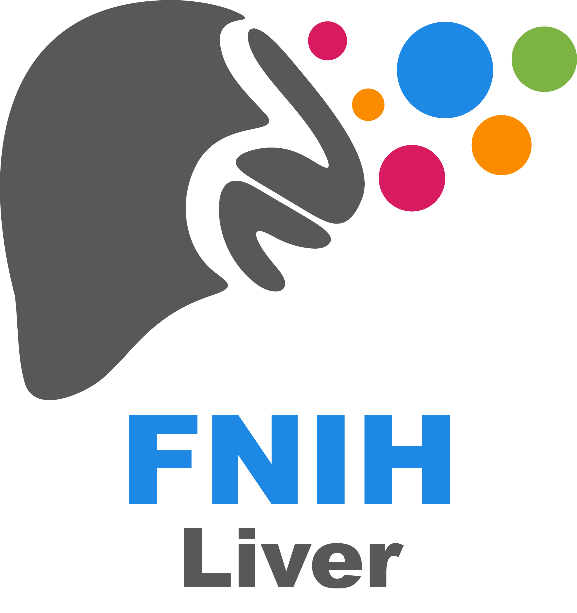

# FNIH Liver  
FNIH Liver is a single-nuclei, multi-modalities epigenetic atlas of metabolic dysfunction-associated steatotic liver disease (MASLD)
  

🍷 This repository contains code and data to reproduce the results for manuscript: **Single cell multiomics reveals drivers of metabolic dysfunction-associated steatohepatitis**

## Abstract
Metabolic dysfunction-associated steatotic liver disease (MASLD) has limited treatments, and cell type-specific regulatory networks driving MASLD represent therapeutic avenues. We assayed five transcriptomic and epigenomic modalities in 2.4M cells from 86 livers across MASLD stages. Integrating modalities increased annotation of the genome in liver cell types several-fold over previous catalogs. We identified cell type regulatory networks of MASLD progression, including distinct hepatocyte networks driving MASL and mild and severe fibrosis MASH. Our single cell atlas annotated 88% of MASH-associated loci, including a third affecting hepatocyte regulation which we linked to distal target genes. Finally, we characterized hepatocyte heterogeneity, including MASH-enriched populations with altered repression, localization, and signaling. Overall, our results provide high-resolution maps of liver cell types and revealed novel targets for anti-MASH therapy.

## [Scripts](https://github.com/Gaulton-Lab/FNIH.Liver/tree/main/Scripts)
This directory contains scripts for pre-processing data from different modalities. 

## [Notebooks/](https://github.com/Gaulton-Lab/FNIH.Liver/tree/main/Notebooks)
This directory contains code for re-producing figures in our manuscript. 

## [Data](https://github.com/Gaulton-Lab/FNIH.Liver/tree/main/Data)
Processed data are available at https://epigenome.wustl.edu/MASLD/. Raw and supplementary data will be available soon.
